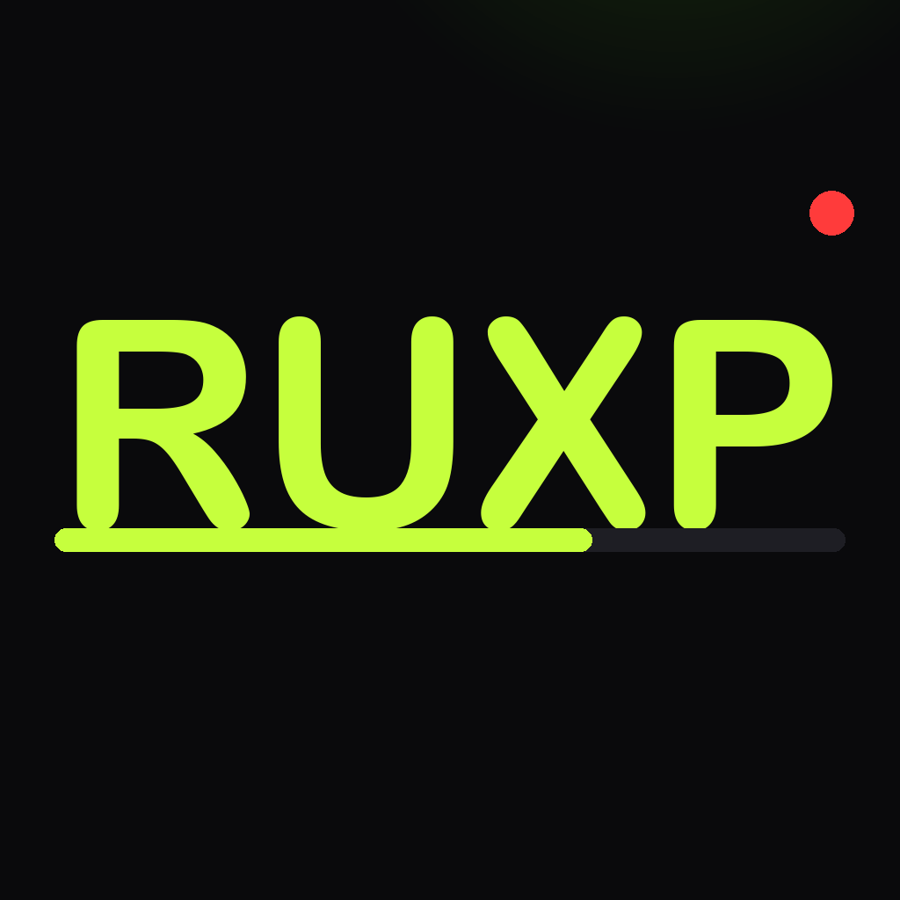

<p align="center">
  
</p>

<h1 align="center">RUXP</h1>

<p align="center">
  <strong>The place you open when you're about to lift.</strong>
</p>

<p align="center">
  
  
  
</p>

---

You might be alone at the gym on a Friday night, but you are not lifting alone. RUXP is a social, live-feeling weightlifting app for iPhone and Apple Watch. It makes the gym feel like something is happening right now.

## The loop

```
OPEN → SEE WHAT'S HAPPENING → START WORKOUT → EARN XP → SEE OTHER PEOPLE TRAINING → FINISH → COME BACK
```

That is the whole MVP. Everything in the app exists to serve it.

## What you see

**Home** answers four questions in one glance: who is training right now, is anything special happening, what level am I, should I start lifting.

```
RUXP                              S01 · BACK 2 SCHOOL
12,481 ● LIFTING NOW
482 workouts finished in the last hour

● LIVE NOW                                   +500 XP
FRIDAY NIGHT
4,208 players joined
Train tonight. Earn bonus XP.
[ JOIN + START WORKOUT ]

YOU   LVL 12   3,420 / 4,000 XP
THIS WEEK  3 workouts   One more for your weekly bonus.
```

**Workout** is the Momentary engine: a real HealthKit strength session, voice notes transcribed on the fly, "8,903 still lifting" while you train, and the active event if one is live.

**Complete** is the moment that matters:

```
WORKOUT COMPLETE
  WORKOUT COMPLETE     +500 XP
  FRIDAY NIGHT         +500 XP
  NEW PR               +250 XP
+1,250 XP   LVL 12 → LVL 13
12,914 people trained tonight.
[ CONTINUE ]
```

**Train** is your history. **Profile** is your player card: level, lifetime XP, workouts, week streak, PRs, season, join date.

**Apple Watch** is for training, not browsing: lifting-now count, active event, Start Workout, timer, voice notes, End, then XP earned.

## XP

Users earn XP for healthy, useful behavior. Grinding is not rewarded.

| Action | XP | Rule |
|---|---|---|
| Complete a workout | +500 | 10+ minutes, max 2 rewarded per day |
| Join a live event | +250 / +500 | Workout overlaps the event window |
| Weekly consistency | +500 | 4th workout of the ISO week |
| Personal record | +250 | Max 2 per workout, only after AI parses your notes |

Level 1–100 is derived from **season XP**; **lifetime XP** is a career total. Season 01 is BACK 2 SCHOOL (Sep 1 – Nov 30, 2026): 32 workouts, finish the season. Everything lives in `ProgressionService`.

## Live presence and events

Live counts are **simulated in this build**. `SimulatedLivePresence` generates believable numbers from a time-of-day curve so the UX can be felt before a backend exists. It sits behind `LivePresenceProviding`; a real-time service replaces it without touching a view. Events (FRIDAY NIGHT, SUNDAY RESET, the BACK 2 SCHOOL season theme) come from `ScheduledEventService` behind `LiveEventProviding`.

## Architecture

```
RUXP/
├── RUXP.xcodeproj
├── Shared/                        (both targets)
│   ├── Models.swift               Workout, exercise/set/rep/weight, wire messages
│   ├── WorkoutStore.swift         Directory-per-workout JSON persistence
│   ├── HealthKitService.swift     HKWorkoutSession (watch) / manual HKWorkout (phone)
│   ├── ConnectivityConstants.swift
│   └── RUXP/
│       ├── LevelCurve.swift       Levels 1–100
│       ├── ProgressionModels.swift PlayerProgress, XPAward, WorkoutRewardSummary
│       ├── ProgressionService.swift Centralized XP / level / streak (player_progress.json)
│       ├── Season.swift           SEASON 01 — BACK 2 SCHOOL
│       ├── LiveEvents.swift       LiveEvent, LiveEventProviding, ScheduledEventService
│       └── LivePresence.swift     LiveSnapshot, LivePresenceProviding, SimulatedLivePresence
├── RUXP/                          (iOS target)
│   ├── RUXPApp.swift
│   ├── WorkoutManager.swift       Start/end, awards completion XP, pushes reward to watch
│   ├── AIProcessingPipeline.swift OpenAI parse → structured log → PR detection → PR XP
│   ├── InsightsStore.swift        Lifetime stats, personal records
│   └── Views/
│       ├── MainTabView.swift      HOME / TRAIN / PROFILE + one workout cover
│       ├── HomeView.swift         The lobby
│       ├── TrainView.swift        History
│       ├── ProfileView.swift      Player card
│       ├── ActiveWorkoutTab.swift Live workout
│       ├── WorkoutCompletionSheet.swift  Reward screen
│       └── Components/RUXPComponents.swift
└── RUXP Watch App/                (watchOS target)
    ├── WatchWorkoutManager.swift  Workout lifecycle, receives XP from phone
    └── Views/                     WatchHomeView, ActiveWorkoutView, WorkoutSummaryView
```

See [docs/ARCHITECTURE.md](docs/ARCHITECTURE.md) for the protocols and what a real backend replaces.

## Quick start

```bash
open RUXP.xcodeproj
```

Schemes: `RUXP` (iPhone) and `RUXP Watch App`. Bundle IDs `com.whussey.ruxp` and `com.whussey.ruxp.watchkitapp`.

### Requirements
- Xcode 16+ (built with 26.3)
- iOS 18.0+ / watchOS 11.0+

### Setup
1. Select your signing team.
2. Build and run on your devices.
3. Optional: add an OpenAI API key in Profile › Settings. It powers transcription and parsing voice notes into sets, reps, weight, and PRs. XP for completing workouts never depends on it.

### Debug helpers
Debug builds add a Developer section in Settings (load 7 sample workouts, pretend it is Friday night, skip the 10-minute minimum) and accept launch arguments `-RUXPSkipMinimum` and `-RUXPEventClock friday|sunday|tuesday`.

## Privacy

Voice notes are sent to OpenAI for transcription and parsing only when you add your own API key. No analytics, no tracking, no accounts. Live counts are generated on device.

## License

[MIT](LICENSE)
